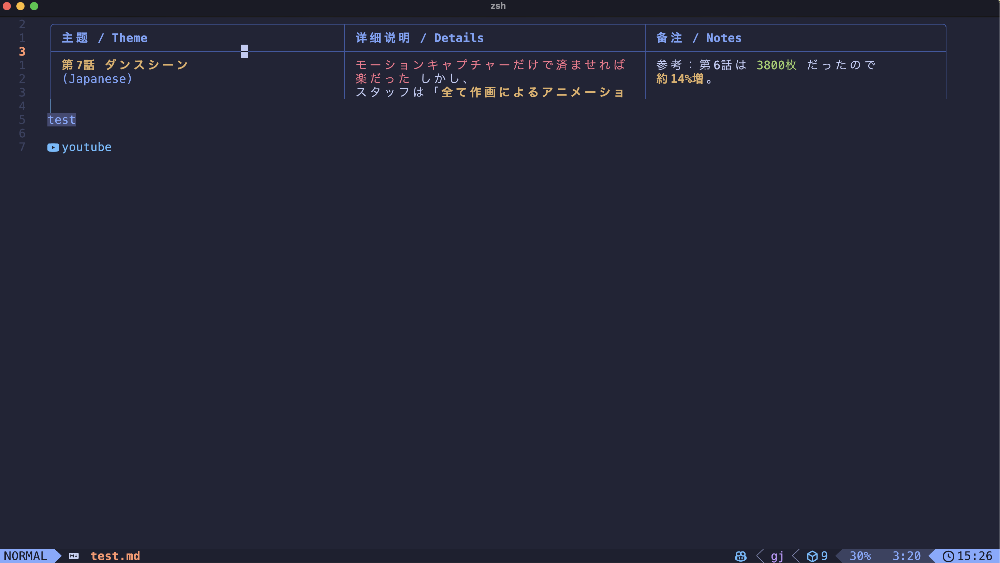
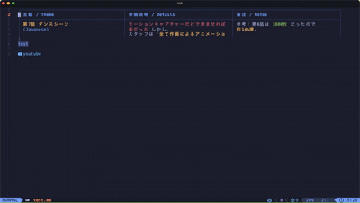
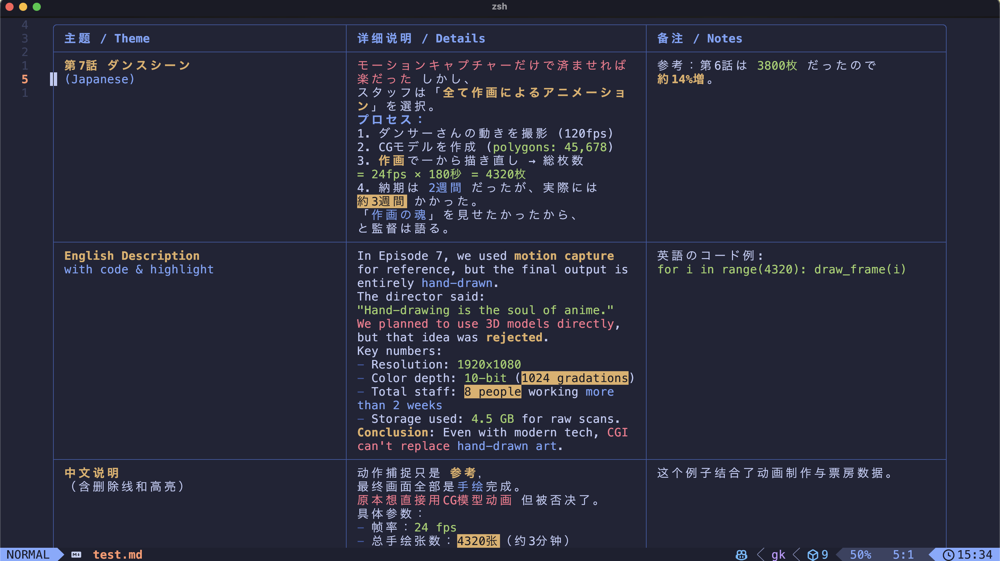
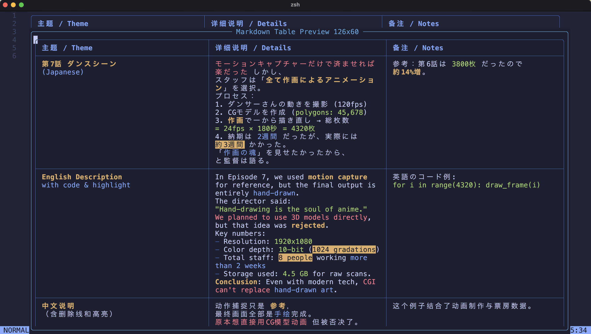

# markdown-table-wrap.nvim

A small Neovim/LazyVim helper plugin for previewing Markdown pipe tables with wrapped cell content.

It does not modify the Markdown buffer and does not fork or patch `render-markdown.nvim`. The default preview is a replace-like inline render built with extmarks, conceal, overlay virtual text, and virtual lines. A floating preview is still available for comparison.

## Why

`render-markdown.nvim` makes normal Markdown tables pleasant to read, but very long cell content can still overflow the terminal width. Neovim's normal line wrapping breaks the whole source line, so table borders and columns no longer line up visually.

`markdown-table-wrap.nvim` solves this by parsing the pipe table under the cursor, calculating display widths with `vim.api.nvim_strwidth`, wrapping long cell content, hiding the source table text with conceal, and drawing a Unicode table in place.

## Screenshots

Inline rendering in a Tokyo Night themed Markdown buffer:



Viewport scrolling for rendered tables taller than their source table:



Full inline expansion when viewport mode is disabled:



Floating preview for long table reading:



## Features

- Version: `0.1.0`.
- Automatic Markdown-only rendering; commands are optional controls.
- Detects the pipe table under the cursor.
- Parses header, separator, alignment, and body rows.
- Computes available width from the current window.
- Wraps long cell content inside each column.
- Supports mixed Chinese, English, and Japanese display widths through `vim.api.nvim_strwidth`.
- Keeps Markdown inline code spans such as `` `Rc<RefCell<T>>` `` and `` `notes/01-smart-pointers.md` `` intact.
- Handles pipes inside single-backtick and double-backtick inline code spans.
- Prefers wrapping at spaces, `、`, `，`, `,`, `；`, `;`, and `/`.
- Renders a Unicode table inline in a replace-like mode.
- Automatically renders the table under the cursor and clears when leaving the table.
- Debounces cursor movement and text changes.
- Reveals the Markdown source while typing in Insert mode, then restores the rendered table on `InsertLeave`.
- Skips redraws when the active table content, width, and render options have not changed.
- Avoids re-render scheduling on normal cursor movement when whole-buffer rendering is active.
- Restores window-local `conceallevel` after clearing replace mode.
- Highlights rendered borders, headers, inline code spans, and Markdown links separately.
- Renders common inline Markdown inside cells to plain display text, including inline code, emphasis, strikethrough, and links.
- Supports `==highlight==`, wiki links, image alt text, and URL-pattern-based link icons.
- Theme presets for Tokyo Night, Catppuccin, a neutral default, and a render-markdown-inspired palette.
- Supports inline custom themes and loading custom theme files from a theme directory.
- Provides source-aware table cell navigation commands.
- Provides inline viewport scrolling for rendered rows that exceed the original source table height.
- Can also render the same table in a floating window.
- Does not edit the source buffer.
- No external binaries.
- Neovim 0.10+.

## Installation With LazyVim

For local development, clone or place this directory somewhere on disk, then add:

```lua
-- ~/.config/nvim/lua/plugins/markdown-table-wrap.lua
return {
  {
    dir = "~/Code/lazyvim-table/markdown-table-wrap.nvim",
    ft = "markdown",
    opts = {
      max_width_ratio = 0.9,
      min_col_width = 8,
      max_col_width = 50,
      border = "rounded",
      use_unicode_border = true,
      table_border = "rounded",
      row_separator = true,
      preview_mode = "inline",
      inline_mode = "replace",
      inline_position = "above",
      dim_source = true,
      auto_preview = true,
      render_all = true,
      auto_preview_in_insert = false,
      clear_on_cursor_leave = true,
      clear_on_insert = true,
      debounce_ms = 80,
      overlay_priority = 10000,
      overlay_fill = true,
      inline_viewport_scrolling = true,
      highlight_preset = "tokyonight",
      theme_dir = nil,
      themes = {},
      highlights = {},
      map_gx = true,
      link = {
        wiki = { icon = " ", highlight = "MarkdownTableWrapWikiLink", scope_highlight = "MarkdownTableWrapWikiLink" },
        image = " ",
        custom = {
          github = { pattern = "github", icon = " " },
          gitlab = { pattern = "gitlab", icon = "󰮠 " },
          youtube = { pattern = "youtube", icon = " " },
          bilibili = { pattern = "bilibili", icon = "󰟴 " },
          cern = { pattern = "cern.ch", icon = " " },
        },
      },
    },
    keys = {
      { "<leader>mt", "<cmd>MarkdownTableTogglePreview<cr>", desc = "Toggle Markdown table preview" },
      { "<leader>mp", "<cmd>MarkdownTablePreview<cr>", desc = "Preview Markdown table inline" },
      { "<leader>mf", "<cmd>MarkdownTableFloatPreview<cr>", desc = "Float Markdown table preview" },
      { "<leader>mc", "<cmd>MarkdownTableClosePreview<cr>", desc = "Close Markdown table preview" },
      { "<leader>mT", "<cmd>MarkdownTableToggleAutoPreview<cr>", desc = "Toggle auto Markdown table preview" },
      { "<leader>mq", "<cmd>MarkdownTableToggleInlineViewport<cr>", desc = "Toggle inline table viewport" },
      { "]c", "<cmd>MarkdownTableNextCell<cr>", desc = "Next table cell" },
      { "[c", "<cmd>MarkdownTablePrevCell<cr>", desc = "Previous table cell" },
      { "]r", "<cmd>MarkdownTableNextRow<cr>", desc = "Next table row" },
      { "[r", "<cmd>MarkdownTablePrevRow<cr>", desc = "Previous table row" },
      { "<leader>mj", function() require("markdown-table-wrap").scroll_view(vim.v.count1) end, desc = "Scroll rendered table down" },
      { "<leader>mk", function() require("markdown-table-wrap").scroll_view(-vim.v.count1) end, desc = "Scroll rendered table up" },
      { "<leader>mgg", "<cmd>MarkdownTableScrollTop<cr>", desc = "Scroll rendered table to top" },
      { "<leader>mG", "<cmd>MarkdownTableScrollBottom<cr>", desc = "Scroll rendered table to bottom" },
    },
  },
}
```

If you publish it to GitHub, switch `dir` to your repository name:

```lua
return {
  {
    "ice345/markdown-table-wrap.nvim",
    ft = "markdown",
    opts = {},
  },
}
```

See [PUBLISHING.md](PUBLISHING.md) for the release flow.

### Coexisting With render-markdown.nvim

Use `render-markdown.nvim` for the rest of Markdown, but disable its table renderer so this plugin owns pipe tables:

```lua
-- ~/.config/nvim/lua/plugins/render-markdown.lua
return {
  "MeanderingProgrammer/render-markdown.nvim",
  opts = {
    pipe_table = {
      enabled = false,
    },
  },
}
```

## Commands

You do not need commands for normal use. With `auto_preview = true`, the table under the cursor renders automatically in Markdown buffers. The commands below are for manual control and debugging.

- `:MarkdownTablePreview` opens the configured preview mode. By default this is inline.
- `:MarkdownTableInlinePreview` renders an inline preview for the table under the cursor.
- `:MarkdownTableFloatPreview` opens a floating preview for the table under the cursor.
- `:MarkdownTableTogglePreview` toggles the active preview.
- `:MarkdownTableClosePreview` closes the preview.
- `:MarkdownTableRefresh` force refreshes rendered tables in the current Markdown buffer.
- `:MarkdownTableEnableAutoPreview` enables automatic preview in the current buffer.
- `:MarkdownTableDisableAutoPreview` disables automatic preview in the current buffer.
- `:MarkdownTableToggleAutoPreview` toggles automatic preview in the current buffer.
- `:MarkdownTableToggleInlineViewport` toggles between viewport-sliced inline rendering and full inline rendering.
- `:MarkdownTableStatus` shows the current auto-preview state.
- `:MarkdownTableNextCell` moves to the next source cell in the current table row.
- `:MarkdownTablePrevCell` moves to the previous source cell in the current table row.
- `:MarkdownTableNextRow` moves to the same source cell in the next table row.
- `:MarkdownTablePrevRow` moves to the same source cell in the previous table row.
- `:MarkdownTableOpenLink` opens the first link in the current source table cell.
- `:MarkdownTableScrollDown` scrolls the rendered table view down without moving through source rows.
- `:MarkdownTableScrollUp` scrolls the rendered table view up without moving through source rows.
- `:MarkdownTableScrollTop` jumps the rendered table viewport to the top.
- `:MarkdownTableScrollBottom` jumps the rendered table viewport to the bottom.

Press `q` inside the floating preview window to close it.

The plugin maps `gx` in Markdown buffers by default. This is necessary because rendered links are virtual text; native `gx` sees the concealed source word under the cursor, which can produce failures such as `vim.ui.open("Details")`. `MarkdownTableOpenLink` instead reads the current source table cell and opens the actual URL from `[text](url)`, `(text)[url]`, or image links.

## Configuration

```lua
require("markdown-table-wrap").setup({
  max_width_ratio = 0.9,
  min_col_width = 8,
  max_col_width = 50,
  border = "rounded",
  use_unicode_border = true,
  table_border = "rounded",
  row_separator = true,
  preview_mode = "inline",
  inline_mode = "replace",
  inline_position = "above",
  dim_source = true,
  auto_preview = true,
  render_all = true,
  auto_preview_in_insert = false,
  clear_on_cursor_leave = true,
  clear_on_insert = true,
  debounce_ms = 80,
  overlay_priority = 10000,
  overlay_fill = true,
  inline_viewport_scrolling = true,
  highlight_preset = "tokyonight",
  theme_dir = nil,
  themes = {},
  highlights = {},
  map_gx = true,
  link = {
    wiki = { icon = " ", highlight = "MarkdownTableWrapWikiLink", scope_highlight = "MarkdownTableWrapWikiLink" },
    image = " ",
    custom = {
      github = { pattern = "github", icon = " " },
      gitlab = { pattern = "gitlab", icon = "󰮠 " },
      youtube = { pattern = "youtube", icon = " " },
      bilibili = { pattern = "bilibili", icon = "󰟴 " },
      cern = { pattern = "cern.ch", icon = " " },
    },
  },
})
```

Options:

- `max_width_ratio`: maximum preview table width as a ratio of the current window width.
- `min_col_width`: minimum content width for each column.
- `max_col_width`: maximum natural content width before wrapping.
- `border`: floating window border style.
- `use_unicode_border`: use Unicode table drawing characters. Set to `false` for ASCII.
- `table_border`: `"rounded"` or `"single"` for rendered table corners.
- `row_separator`: draw horizontal separators between body rows for clearer cell grouping.
- `preview_mode`: `"inline"` or `"float"` for `:MarkdownTablePreview`.
- `inline_mode`: `"replace"` or `"insert"`. Replace mode hides source text and overlays the rendered table in place.
- `inline_position`: `"above"` or `"below"` for insert mode.
- `dim_source`: dim the original Markdown table lines while insert mode is active.
- `auto_preview`: automatically render when the cursor is inside a Markdown table.
- `render_all`: render all Markdown tables in the current buffer instead of only the cursor table.
- `auto_preview_in_insert`: keep replacement rendering active while typing in Insert mode.
- `clear_on_cursor_leave`: clear inline rendering when the cursor leaves a table or window.
- `clear_on_insert`: reveal source Markdown while editing, then re-render on `InsertLeave`.
- `debounce_ms`: delay before automatic refresh after movement or text changes.
- `overlay_priority`: extmark priority used to cover other renderers such as `render-markdown.nvim`.
- `overlay_fill`: fill the rest of each rendered source line with blank overlay text so long source rows do not leak past the rendered table.
- `inline_viewport_scrolling`: let `:MarkdownTableScrollDown` and `:MarkdownTableScrollUp` page through rendered rows inside the original table height. Disable it to show the complete rendered table inline with extra virtual lines.
- `highlight_preset`: `"tokyonight"`, `"catppuccin"`, `"default"`, `"render_markdown"`, or `"auto"`.
- `theme_dir`: optional directory containing custom theme files named `<preset>.lua`.
- `themes`: inline custom theme table keyed by preset name.
- `highlights`: override highlight specs by semantic key.
- `map_gx`: map `gx` in Markdown buffers to `:MarkdownTableOpenLink` with fallback to native `gx`.
- `link`: icon configuration for links, wiki links, images, and URL pattern matches.

Highlight override example:

```lua
require("markdown-table-wrap").setup({
  highlight_preset = "tokyonight",
  highlights = {
    border = { fg = "#7aa2f7" },
    code = { fg = "#9ece6a" },
    bold = { fg = "#e0af68", bold = true },
    italic = { fg = "#7aa2f7", italic = true },
    strike = { fg = "#f7768e", strikethrough = true },
    mark = { fg = "#1a1b26", bg = "#e0af68" },
    link = { fg = "#7dcfff", underline = true },
  },
})
```

Custom theme example:

```lua
require("markdown-table-wrap").setup({
  highlight_preset = "my_theme",
  themes = {
    my_theme = {
      border = { fg = "#89b4fa" },
      inline = { fg = "#cdd6f4" },
      source = { link = "Comment" },
      header = { fg = "#f9e2af", bold = true },
      code = { fg = "#a6e3a1" },
      link = { fg = "#89dceb", underline = true },
      wiki_link = { fg = "#cba6f7", underline = true },
      image = { fg = "#94e2d5" },
      bold = { fg = "#f9e2af", bold = true },
      italic = { fg = "#cba6f7", italic = true },
      strike = { fg = "#f38ba8", strikethrough = true },
      mark = { fg = "#1e1e2e", bg = "#f9e2af" },
      blank = { link = "Normal" },
    },
  },
})
```

Theme directory example:

```lua
require("markdown-table-wrap").setup({
  highlight_preset = "my_theme",
  theme_dir = vim.fn.stdpath("config") .. "/markdown-table-wrap-themes",
})
```

Then create `~/.config/nvim/markdown-table-wrap-themes/my_theme.lua` returning the same table shape.

Link icon example:

```lua
require("markdown-table-wrap").setup({
  link = {
    wiki = { icon = " ", highlight = "MarkdownTableWrapWikiLink", scope_highlight = "MarkdownTableWrapWikiLink" },
    image = " ",
    custom = {
      github = { pattern = "github", icon = " " },
      gitlab = { pattern = "gitlab", icon = "󰮠 " },
      youtube = { pattern = "youtube", icon = " " },
      bilibili = { pattern = "bilibili", icon = "󰟴 " },
      cern = { pattern = "cern.ch", icon = " " },
    },
  },
})
```

Standard Markdown links use `[text](url)`. The plugin also accepts `(text)[url]` as a convenience form inside table cells.

Semantic highlight keys:

- `border`
- `inline`
- `source`
- `header`
- `code`
- `link`
- `wiki_link`
- `image`
- `bold`
- `italic`
- `strike`
- `mark`
- `blank`

## Example

Place the cursor anywhere inside this table and run `:MarkdownTablePreview`:

| 名称 | 说明 | 路径 |
| --- | --- | --- |
| Rc | `Rc<RefCell<T>>` 常用于需要共享所有权并且在运行时检查可变借用的场景，尤其适合写解释器、树结构、图结构。 | `notes/01-smart-pointers.md` |
| render-markdown.nvim | 当表格某一列非常长，Neovim 原生 wrap 会把整行硬折断，导致边框和列对齐错乱。 | lua/plugins/render-markdown.lua |

## Current Scope

This is intentionally a minimal usable version:

- Replace-like inline preview by default.
- Automatic whole-buffer table rendering by default.
- Command-free default workflow: edit source in Insert mode, view rendered table in Normal mode.
- Cached refreshes to avoid unnecessary redraw flicker.
- Window-local conceal handling with restoration on clear.
- Semantic highlights for borders, headers, inline code, and links.
- Cell navigation commands that understand inline code pipes like `` `a|b` ``.
- Floating preview retained as a fallback.
- Floating preview is recommended for long tables when you want normal cursor-addressable preview rows.
- Basic Markdown pipe table parsing.
- Inline code spans are treated as indivisible chunks.
- Escaped pipes are displayed as `|`.
- A headless Neovim regression suite exists in `tests/run.lua`.
- Tests are split by parser, inline Markdown, width, wrapping, rendering, theme, inline extmarks, and system render chain.

## Testing

Run the current regression suite from the repository root:

```sh
nvim --headless -u NONE --cmd "set shadafile=NONE" --cmd "set noswapfile" \
  -c "set rtp+=." \
  -c "luafile tests/run.lua" \
  -c "qa!"
```

The suite currently covers:

- GFM-style pipe tables with optional outer pipes.
- Escaped pipes and pipes inside inline code.
- Multi-backtick inline code spans with internal pipes.
- Alignment rows and missing/extra cells.
- Adjacent pipe-like prose that must not be concealed as part of a table.
- Mixed CJK/English width and hard breaks.
- Width helpers and display-width-aware padding.
- Inline token highlighting through wrapping, floating preview, and inline replacement.
- Link icons, `==highlight==`, inline custom themes, and theme-directory loading.
- Whole-buffer automatic rendering through Neovim extmarks.

When running from the parent development directory, use:

```sh
nvim --headless -u NONE --cmd "set shadafile=NONE" --cmd "set noswapfile" \
  -c "set rtp+=./markdown-table-wrap.nvim" \
  -c "luafile markdown-table-wrap.nvim/tests/run.lua" \
  -c "qa!"
```

## Healthcheck

```vim
:checkhealth markdown-table-wrap
```

## Help

```vim
:help markdown-table-wrap
```

The default mode hides the source table text with extmark conceal and overlays rendered rows on top of the original table rows. This is a visual replacement, not a buffer edit. It does not yet implement Treesitter-aware table discovery or full GitHub Flavored Markdown table edge cases.

With `inline_viewport_scrolling = true`, long rendered tables are shown as a scrollable visual slice inside the original source table height. Use `:MarkdownTableScrollDown` / `:MarkdownTableScrollUp` for inline reading, or `:MarkdownTableFloatPreview` for a fully scrollable preview buffer.

Use `:MarkdownTableToggleInlineViewport` when you prefer the full inline expansion. In viewport mode, `:MarkdownTableScrollDown` and `:MarkdownTableScrollUp` page through the rendered table slice. In full inline mode, those commands fall back to normal window scrolling because the full rendered table is already visible as virtual lines.

## Roadmap: More Exact Inline Rendering

1. Keep the parser and renderer pure.
2. Add optional window-local fold integration for cases where the rendered table is much shorter than the source table.
3. Add Treesitter-aware table discovery when available, while keeping the current parser fallback.
4. Add editable cell popups for long wrapped cells.
5. Add configurable highlight groups and optional link/code icons.
6. Keep all modes view-only so the Markdown buffer is never modified.

## Project Structure

```text
markdown-table-wrap.nvim/
├── .github/
│   ├── ISSUE_TEMPLATE/
│   │   ├── bug_report.yml
│   │   └── feature_request.yml
│   ├── pull_request_template.md
│   └── workflows/
│       └── ci.yml
├── CHANGELOG.md
├── CONTRIBUTING.md
├── PUBLISHING.md
├── README.md
├── ROADMAP.md
├── RELEASE.md
├── LICENSE
├── doc/
│   ├── markdown-table-wrap.txt
│   └── tags
├── docs/
│   ├── 01-inline-tokyonight.png
│   ├── 02-inline-scroll.gif
│   ├── 02b-inline-full-toggle.png
│   └── 03-floating-long-table.png
├── stylua.toml
├── plugin/
│   └── markdown-table-wrap.lua
├── lua/
│   └── markdown-table-wrap/
│       ├── init.lua
│       ├── health.lua
│       ├── inline.lua
│       ├── markdown.lua
│       ├── nav.lua
│       ├── parser.lua
│       ├── theme.lua
│       ├── width.lua
│       ├── wrap.lua
│       └── render.lua
└── tests/
    ├── helpers.lua
    ├── run.lua
    └── spec/
```

## License

MIT
